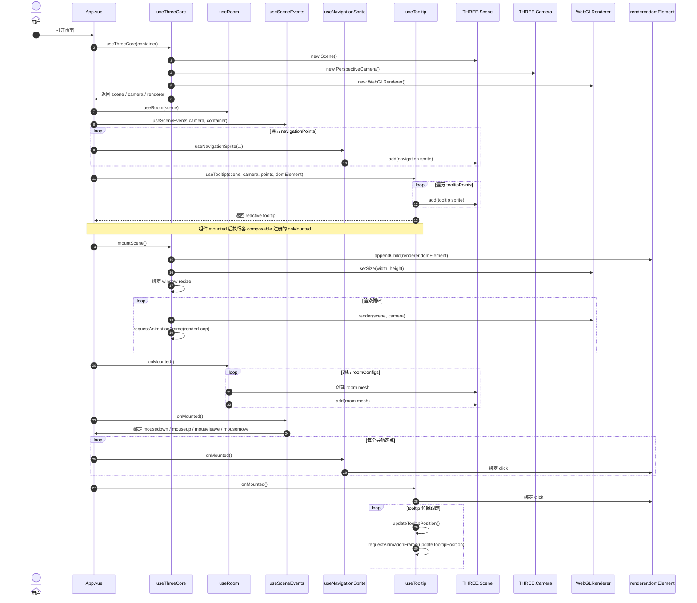
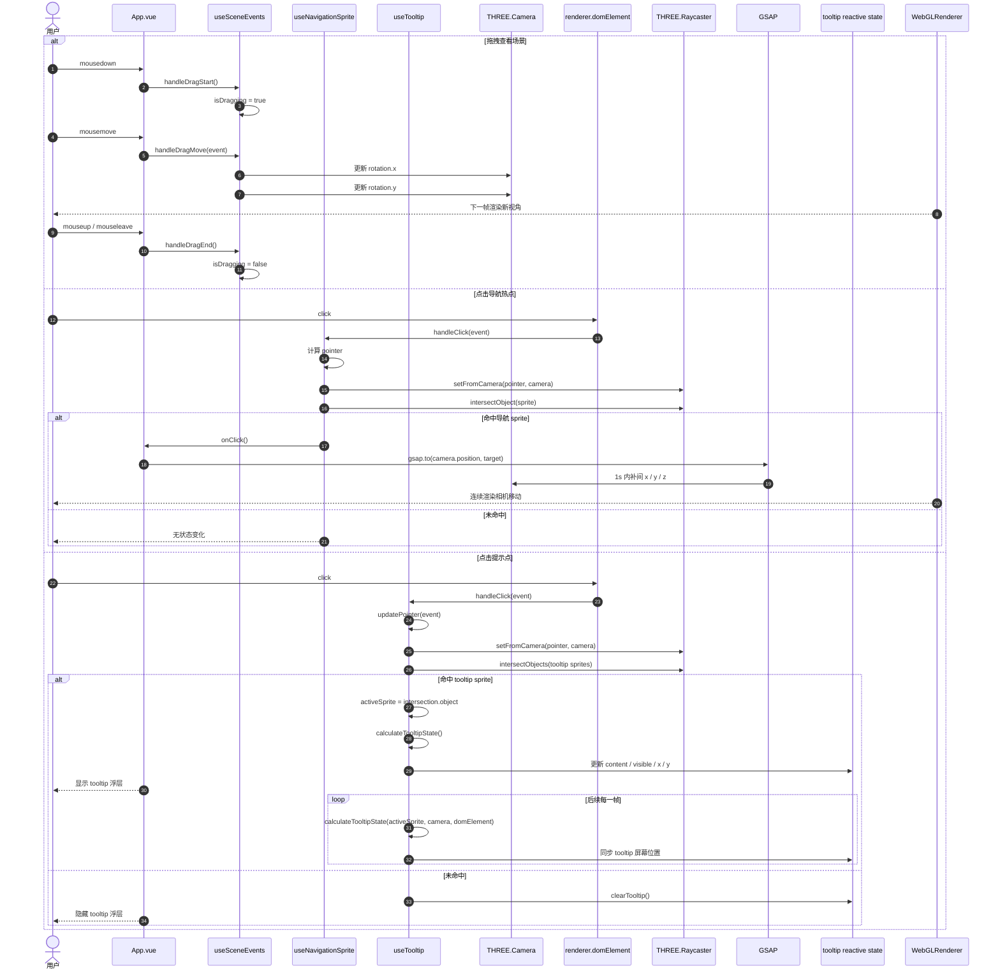

# 时序图

本文档基于当前项目实现整理，拆成两张 Mermaid 时序图：

- 初始化时序图：描述 Vue 组件挂载后，Three.js 场景、房间、导航热点和提示点如何初始化。
- 交互时序图：描述拖拽视角、点击导航热点、点击提示点时的运行链路。

对应实现主要分布在：

- [App.vue](../src/App.vue)
- [use-three-core.ts](../src/composables/use-three-core.ts)
- [use-room.ts](../src/composables/use-room.ts)
- [use-navigation.ts](../src/composables/use-navigation.ts)
- [use-tooltip.ts](../src/composables/use-tooltip.ts)
- [use-scene-event.ts](../src/composables/use-scene-event.ts)
- [config/index.ts](../src/config/index.ts)

## 初始化时序图

## 交互时序图

## 备注

- 当前房间不是按点击动态加载，而是在初始化阶段一次性把 `living`、`balcony`、`kitchen` 三个盒子空间加入同一个 `Scene`。
- 导航热点和提示点都监听 `renderer.domElement` 上的 `click` 事件，各自独立完成射线检测和后续处理。
